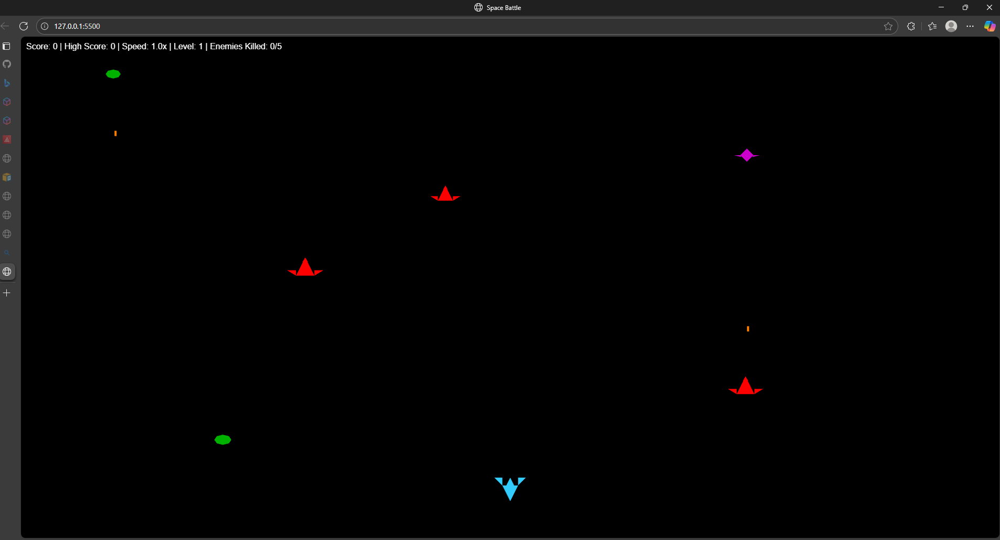

# Space Battle - WebGL Game

A high-performance space shooter game built with pure WebGL and JavaScript, featuring advanced particle effects, multiple enemy types and progressive difficulty scaling.



## 🎮 Play Now

**[Play Live Demo](https://Jeremia-dotcom.github.io/space-battle-game)**

## 🌟 Features

### Core Gameplay
- **5 Progressive Levels**: Increasing difficulty with more enemies and faster gameplay
- **Multiple Enemy Types**: 4 distinct enemy types with unique behaviors
  - Basic (Red): Standard movement, 1 HP
  - Advanced (Purple): Faster movement, 2 HP
  - Tank (Green): Slow but tanky, 4 HP

### Advanced Mechanics
- **Dynamic Movement Patterns**: Enemies use zigzag, sweep, spiral, and sine wave patterns
- **Powerup System**: 
  - 🟢 Speed Boost
  - 🟡 Rapid Fire
  - 🔵 Shield
- **Particle Effects**: Real-time explosion animations with physics
- **Adaptive Difficulty**: Game speed increases with score
- **High Score Tracking**: Persistent high score display

### Visual Features
- **Custom Spaceship Models**: Procedurally generated using WebGL vertices
- **Explosion Effects**: Dynamic particle systems with color gradients
- **Victory Celebrations**: Multi-explosion effects on level completion
- **Responsive Design**: Adapts to window resizing

## 🛠️ Technologies

- **WebGL**: Hardware-accelerated 3D graphics
- **GLSL Shaders**: Custom vertex and fragment shaders
- **Vanilla JavaScript**: No frameworks, pure performance
- **HTML5 Canvas**: Full-screen game rendering
- **CSS3**: UI overlays and instruction screens

## 🎯 How to Play

### Controls
- **← →** Arrow Keys: Move spaceship left/right
- **SPACE**: Fire bullets
- **R**: Restart game (after game over)
- **Click**: Start game / Dismiss instructions

### Objective
- Defeat 5 enemies to complete Level 1
- Progress through 5 increasingly difficult levels
- Avoid enemy bullets and collisions
- Collect powerups for temporary advantages

## 🚀 Quick Start

### Play Online
Simply visit the [live demo](https://Jeremia-dotcom.github.io/space-battle-game) and click to start!

### Run Locally

1. **Clone the repository**
```bash
git clone https://github.com/Jeremia-dotcom/space-battle-game.git
cd space-battle-game
```

2. **Start a local server**
```bash
# Python 3
python -m http.server 8000

# Python 2
python -m SimpleHTTPServer 8000

# Node.js (with http-server)
npx http-server
```

3. **Open in browser**
```
http://localhost:8000
```

**Note:** You must use a local server due to CORS restrictions with WebGL.

## 📊 Game Architecture

### File Structure
```
space-battle-game/
├── index.html          # Main game page
├── game.js            # Core game logic & mechanics
├── shaders.js         # GLSL shaders & 3D models
├── webgl-utils.js     # WebGL initialization & utilities
└── README.md          # Documentation
```

### Key Components

**game.js** - Core Game Engine
- Game loop with `requestAnimationFrame`
- Entity management (player, enemies, bullets)
- Collision detection system
- Particle system for explosions
- Level progression logic
- Score and difficulty scaling

**shaders.js** - Graphics & Models
- Vertex shader for coordinate transformation
- Fragment shader for coloring
- Procedural spaceship generation
- 4 unique enemy ship designs
- Boss ship model

**webgl-utils.js** - Rendering Pipeline
- WebGL context initialization
- Shader compilation and linking
- Drawing functions (spaceships, particles, rectangles)
- Collision detection helpers
- UI element creation

## 🎨 Enemy Types

| Type | Color | HP | Speed | Points | Special |
|------|-------|----|----|--------|---------|
| Basic | Red | 1 | 1.0x | 100 | Standard movement |
| Advanced | Purple | 2 | 1.3x | 150 | Faster, more aggressive |
| Tank | Green | 4 | 0.8x | 300 | Slow but durable |


## 💡 Technical Highlights

### WebGL Rendering
- Custom shader pipeline for maximum performance
- Vertex buffers updated dynamically per frame
- Efficient batch rendering for particles
- Hardware-accelerated transformations

### Particle System
- 30+ particles per explosion
- Physics-based velocity and decay
- Color gradient effects (red → orange → yellow)
- Optimized lifecycle management

### Collision Detection
- Axis-Aligned Bounding Box (AABB) algorithm
- Efficient hitbox calculations
- Separate hitboxes for player, enemies, bullets

### AI Behavior
- 5 movement patterns: straight, zigzag, sweep, sine, spiral
- Dynamic firing rates based on enemy tier
- Adaptive spawning based on level

## 📈 Scoring System

- **Basic Enemy**: 100 points
- **Advanced Enemy**: 150 points
- **Tank Enemy**: 300 points
- **Speed Bonus**: Game speed increases every 500 points
- **Level Progression**: +10 enemies required per level

## 🐛 Known Issues

- Mobile touch controls not implemented
- No sound effects or music
- High scores not persisted across sessions
- Single-player only

## 🚀 Future Enhancements

- [ ] Touch controls for mobile devices
- [ ] Sound effects and background music
- [ ] LocalStorage for high score persistence
- [ ] Multiple player ship options
- [ ] Weapon upgrades and special abilities
- [ ] Multiplayer mode (WebSockets)
- [ ] More enemy types and bosses
- [ ] Procedurally generated backgrounds
- [ ] Achievement system
- [ ] Leaderboard integration

## 📸 Screenshots

### Gameplay


### Victory Screen


## 🎓 Learning Outcomes

This project demonstrates:
- WebGL fundamentals and GLSL shaders
- Game loop architecture and timing
- Entity-component patterns
- Collision detection algorithms
- Particle system implementation
- Performance optimization techniques
- Responsive canvas rendering

## 📄 Browser Compatibility

- ✅ Chrome 90+ (Recommended)
- ✅ Firefox 88+
- ✅ Safari 14+
- ✅ Edge 90+
- ❌ Internet Explorer (WebGL not supported)

## 👨‍💻 Author

**Ntshwane Jeremia Mphorane**
- Portfolio: [main.d2k1aud08zsf7o.amplifyapp.com](https://main.d2k1aud08zsf7o.amplifyapp.com)
- GitHub: [Jeremia-dotcom](https://github.com/jeremia-dotcom)
- LinkedIn: [Ntshwane Mphorane](https://linkedin.com/in/yourusername)

## 📝 License

This project is open source and available for educational purposes.

## 🙏 Acknowledgments

- WebGL API documentation from MDN
- Game design inspiration from classic arcade shooters
- Particle effects inspired by modern game engines

---

**Built with ❤️ using WebGL, JavaScript, and passion for game development**

**March 2025 - May 2025**
